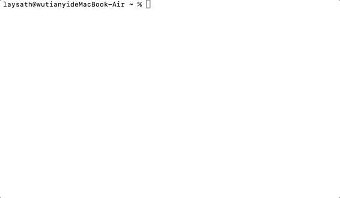

<h1 align="center">fuckit.sh</h1>

<p align="center">
  <strong>English</strong> | <a href="./README.md">简体中文</a>
</p>

<p align="center">
  <a href="https://github.com/faithleysath/fuckit.sh/stargazers">
    
  </a>
  <a href="https://github.com/faithleysath/fuckit.sh/network/members">
    
  </a>
  <a href="https://github.com/faithleysath/fuckit.sh/commits/main">
    
  </a>
  <a href="https://github.com/faithleysath/fuckit.sh/blob/main/LICENSE">
    
  </a>
</p>

**I fucking forgot that command.**

`fuckit.sh` is an AI-powered command-line tool that translates your natural language descriptions directly into executable shell commands.

When you're too lazy to check the `man` pages or search on Google, just `fuck` it.

**This project is completely free to use. You do not need to provide your own OpenAI API Key.**

---

## Preview



---

## Features

*   **Natural Language to Command**: Directly translates your plain English into executable shell commands.
*   **AI-Powered**: Leverages the power of Large Language Models to understand complex instructions.
*   **Interactive Confirmation**: Displays the command and asks for your approval before execution, ensuring safety.
*   **Dual-Mode Operation**: Supports a one-line installer for long-term use and a temporary, no-install mode.
*   **Cross-Platform**: Works on macOS and major Linux distributions.
*   **Bilingual**: Offers a full experience in both English and Chinese.
*   **Smart Context**: Automatically detects OS, package manager, and other info to provide better context to the AI.
*   **Easy Uninstall**: A single command completely removes the script from your system.

---

## Quick Install

Pick your preferred language and run the command below in your terminal.

```bash
curl -sS https://fuckit.sh | bash
```

> [!WARNING]
> **Security Notice (As if you care)**
> 
> If you don't trust piping scripts directly into `bash`, you can do it step-by-step:
> 1.  **Download**: `curl -o fuckit.sh https://fuckit.sh`
> 2.  **Inspect**: `less fuckit.sh`
> 3.  **Run**: `bash fuckit.sh`

After installation, restart your shell or run `source ~/.bashrc` / `source ~/.zshrc` for the command to take effect.

---

## How to Use

It's dead simple. The format is:

```bash
fuck <your prompt>
```

The AI will return the command it thinks is correct. You confirm, and it runs.

**Examples:**

```bash
# Find all files larger than 10MB in the current directory
fuck find all files larger than 10MB in the current directory

# Install git (auto-detects apt/yum/brew, etc.)
fuck install git

# Uninstall git (also auto-detects)
fuck uninstall git
```

### Uninstall

If you want to get rid of me, you can kick me out anytime:

```bash
fuck uninstall
```

---

### Temporary Use (No Installation)

If you don't want to install the script and just need a one-off command, you can run it directly with `curl`.

```bash
curl -sS https://fuckit.sh | bash -s "your prompt"
```

**Example:**
```bash
# Find all files larger than 10MB
curl -sS https://fuckit.sh | bash -s "find all files larger than 10MB"
```

This method won't install any files on your system; the command is executed directly.

---

## How It Works

1.  You type `fuck <your prompt>` in your terminal.
2.  The script sends your prompt and some basic system info (like OS, package manager) to a Cloudflare Worker.
3.  The Cloudflare Worker calls the OpenAI API (or another LLM) with your prompt.
4.  The AI returns the generated shell command.
5.  The script displays the command in your terminal and waits for your confirmation.
6.  You type `y`, the command executes. World peace is achieved.

---

## Developer Guide (For tinkerers)

If you want to deploy this project yourself or modify it, follow these steps.

### Prerequisites

*   A [Cloudflare](https://www.cloudflare.com/) account
*   [Wrangler CLI](https://developers.cloudflare.com/workers/wrangler/install-and-update/)
*   An OpenAI API key (or another OpenAI-compatible API service) **(only required if you self-host)**

### Deployment Steps

1.  **Clone the repository**

    ```bash
    git clone https://github.com/faithleysath/fuckit.sh.git
    cd fuckit.sh
    ```

2.  **Configure `wrangler.toml`**

    You can modify the worker name and routes in the `wrangler.toml` file as needed.

3.  **Configure Secrets**

    You need to add your OpenAI API key as a secret to your Cloudflare Worker.

    ```bash
    npx wrangler secret put OPENAI_API_KEY
    ```

    You can also set optional environment variables:
    *   `OPENAI_API_MODEL`: Specify the model to use, defaults to `gpt-4-turbo`.
    *   `OPENAI_API_BASE`: Specify the API base URL, defaults to `https://api.openai.com/v1`.

4.  **Build `worker.js`**

    The `worker.js` file needs the contents of `main.sh` and `zh_main.sh` to be embedded as Base64 strings. A build command is provided to automate this.

    **macOS:**
    ```bash
    B64_EN=$(base64 -i main.sh) && sed -i.bak "s#^const INSTALLER_SCRIPT =.*#const INSTALLER_SCRIPT = b64_to_utf8(\`${B64_EN}\`);#" worker.js && \
    B64_ZH=$(base64 -i zh_main.sh) && sed -i.bak "s#^const INSTALLER_SCRIPT_ZH =.*#const INSTALLER_SCRIPT_ZH = b64_to_utf8(\`${B64_ZH}\`);#" worker.js && \
    rm worker.js.bak
    ```

    **Linux:**
    ```bash
    B64_EN=$(base64 -w 0 main.sh) && sed -i.bak "s#^const INSTALLER_SCRIPT =.*#const INSTALLER_SCRIPT = b64_to_utf8(\`${B64_EN}\`);#" worker.js && \
    B64_ZH=$(base64 -w 0 zh_main.sh) && sed -i.bak "s#^const INSTALLER_SCRIPT_ZH =.*#const INSTALLER_SCRIPT_ZH = b64_to_utf8(\`${B64_ZH}\`);#" worker.js && \
    rm worker.js.bak
    ```

5.  **Deploy the Worker**

    ```bash
    npx wrangler deploy
    ```

After a successful deployment, your worker will be live at your configured domain.

---

## License

This project is licensed under the MIT License. See the [LICENSE](LICENSE) file for details.

---

## Star History

[](https://app.repohistory.com/star-history)
